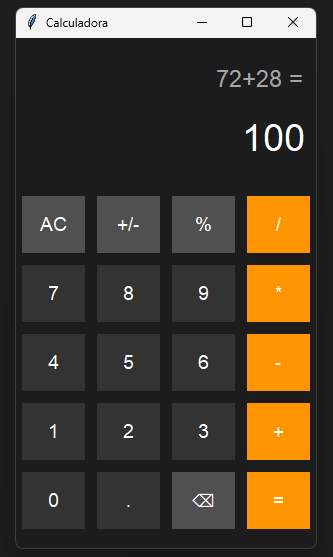

# 愛 iPhone Calculator - Python

Una calculadora con interfaz gráfica desarrollada en Python usando tkinter, inspirada en el diseño minimalista de la calculadora de iPhone.

---

## Demo

---

## 經過 Características

Interfaz moderna estilo iPhone (modo oscuro)

Operaciones básicas:

- Suma (+)
- Resta (-)
- Multiplicación (*)
- División (/)

- Botón de igual integrado
- Botón de borrado (backspace)
- Botón AC para limpiar todo
- Manejo de errores (ej: divisiones inválidas)

---

## 使用 Uso

- Ingresa los números con los botones  
- Selecciona una operación  
- Presiona "=" para obtener el resultado  

---

## 這 Lo que aprendí

- Interfaces gráficas con tkinter  
- Manejo de eventos en botones  
- Manipulación de texto en pantalla  
- Organización del código con funciones  
- Evaluación de expresiones dinámicas con eval()

---

## 🛠️ Tecnologías

- Python 3  
- Tkinter  

---

## Instalación y uso

Clona el repositorio:

git clone https://github.com/RodoCap/iPHONE-CALCU.git

Entra a la carpeta:

cd iPHONE-CALCU

Ejecuta el programa:

python calculadora.py

---

## 📁 Estructura del proyecto

iPHONE-CALCU/
│
├── calculadora.py
├── README.md
└── img/
    └── calculadora.png

---

## 工程 Mejoras futuras

- Implementar funcionamiento completo del botón (%)  
- Agregar funcionalidad (+/-)  
- Botón "0" más ancho (estilo iPhone real)  
- Animaciones al presionar botones  
- Mejorar la experiencia visual (UX)  
- Posible historial de operaciones  

---

## Autor

Desarrollado por Rodolfo Manga Saurith

---

## 📌 Notas

Este proyecto fue realizado como práctica para mejorar habilidades en Python y desarrollo de interfaces gráficas.

---

## ⭐ Si te gustó

Dale una estrella ⭐ al repositorio.
